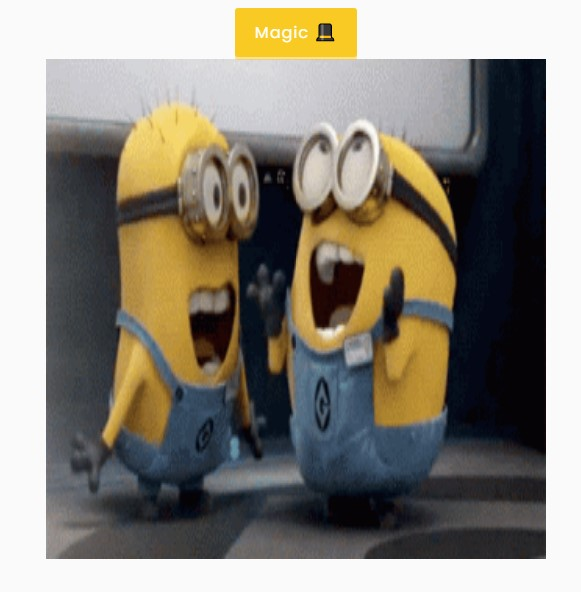
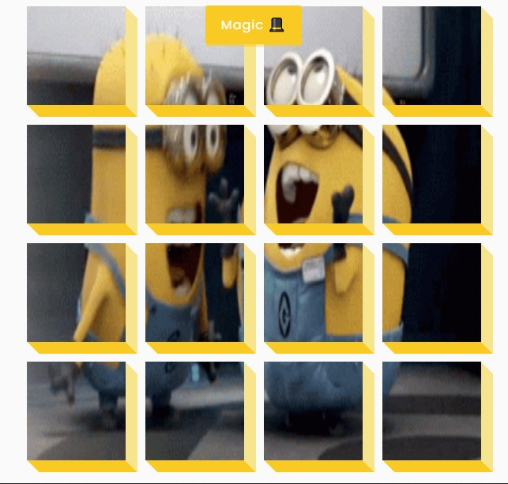
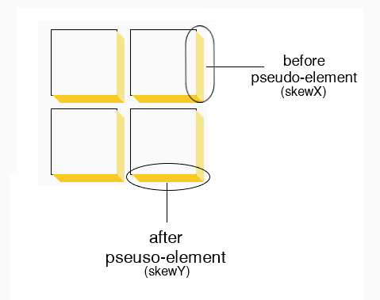

  

  
   
  
  
  

  
# 3D-Background-Boxes: Web Animation &amp; Effect
  This project is built upon three foundational concepts:
  - Background Image Fragmentation
  - CSS & JavaScript Animation Toggling 
  - Cube Modelling with `::before` and `::after`

# Project Screenshots

  
  

  
  
# Concept 1: Background Image Fragmentation
  Our implementation involves dividing a larger background image into 16 equal-sized parts and 
  displaying each part on a separate element using CSS.
  
  By utilizing the background-image, background-size, and background-position properties, 
  each element displays a distinct section of the background image, 
  creating a visually cohesive and engaging design. 
  
  This approach provides an efficient and effective method 
  for implementing complex background images in web design.
  
  
  

  
  
# Concept 2: CSS & JavaScript Animation Toggling
Our implementation involves styling a target element with a class called 'big' using CSS, 
resulting in a different size and a transformation effect (rotateZ(360)) for its children.

We then used JavaScript to toggle this class on and off  
from an element upon a button click event, utilizing the classList.toggle() method.

This allows for dynamic and visually engaging animation effects with minimal code.

  
  
# Concept 3: Cube Modelling with `::before` and `::after`

