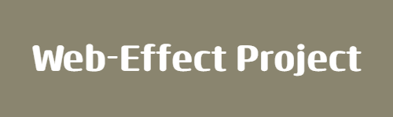

  

  
   
  
  
  

  
# 3D-Background-Boxes: Web Animation &amp; Effect
  Three main concepts outlines the foundation of this project
  - background image decentralization
  - transistion via a class name
  - 3d box modelling with `::before` and `::after`

# Project Screenshots

  
  

  
  
# Concept 1: background image decentralization
  basically we have 16 different elements of equal size (height & width) 
  using the same background image.
  
  Since the is bigger in size than the element, 
  each element shows a part of the background image
  
  This is implemented with the CSS properties: 
  `background-image`, `background-size`, `background-positioning`
  
  
  

  
  
# Concept 2: Transitioning via a class name
basically we styled our target element such that 
if it has a class called "big", two things would happen;
- it would have a different size  
- children of this our target element  
  would go through a transformation (rotateZ(360)) 

then we used javascript to toggle this class on/off from an element 
at the click of a button using the `classList.toggle()` method

  
  
# Concept 3: 3d box modelling with `::before` and `::after`

